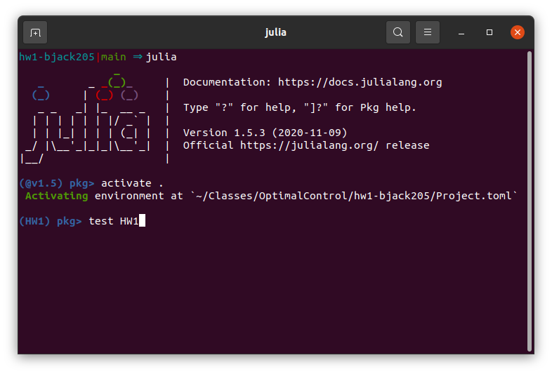

# Autograding
Each homework assignment will come with a set of unit tests that will be used to help us grade your homework. If your code passes all of the provided unit tests, there's a good chance you will get full credit on the assignment. We reserve the right to run your code on a different (more exhaustive) set of unit tests. If you "hack" your solutions to pass the unit tests, or modify the tests themselves (you're welcome to add more tests, just not modify the ones we provide), you will be heavily penalized. 

This document will show you how the autograding process works, how to run the tests locally on your computer, and how to add more tests.

## Overview
We use the built-in unit testing functionality in Julia, combined with GitHub actions to run the tests. You are not required to know the details of how this works, but this section provides a high-level overview of how the testing process works. This workflow is identical to the workflow used in published Julia packages (including Julia itself). Each homework assignment is set up as a Julia package. A minimal Julia package has the following directory structure:
```
./PackageName
    /src
        PackageName.jl
    /test
        runtests.jl
    Manifest.toml
```

### Source Code
The `src/PackageName.jl` will look something like this:
```julia
module HW
using NBInclude

function studentinfo()
    info = Dict(
        "name" => "Brian Jackson",
        "Andrew ID" => "bjackso2"
    )
    return info
end

notebook() = @nbinclude(joinpath(@__DIR__,"hw.ipynb"))

end
```

You are expected to modify the `studentinfo` command with your
personal information.

The `notebook()` method will run the code in your notebook (with the scope of the module). Do not modify this method.

All code you implement and submit for grading should be contained in the `/src` folder. 

### Test files
The `test/runtests.jl` file will look similar to this:

```julia
using HW
using Test
using Pkg
Pkg.status()

HW.notebook()

@testset "Question 1" begin
    @testset "Part a" begin
        @test 1 == 1
        # etc. 
    end
    @testset "Part b" begin
        @test 2 == 2
        # etc.
    end
    # etc.
end
```

The `HW.notebook()` line will run your Jupyter notebook, saving all methods and variables within the `HW` module. For example, if you define a variable `q1a` in your notebook, it can be accessed via `HW.q1a` in the test suite. The tests will 
often be grouped into different test sets, as shown. These may also contain an `include(<question>_test.jl)` command that will include the contents of another file in the test set.

## Running Your Tests
### Autograder on GitHub
Each time you push to your `main` branch, it will trigger a GitHub action that will run your code through the test set. You can check the status of your tests by selecting the "Actions" tap in GitHub (see image below).


If you select a "CI" workflow and then select a "Job" on the left it will show the the results of your test in the main window. You can scroll through the "Run julia-actions/julia-runtest@latest" section it will show the terminal output of the tests, and will show you any errors it encountered or any tests that failed.


### Running the tests locally
To run the tests on your computer you can open a REPL in the root directory of your homework repository. Enter the package manager using `]` and then activate the current environment using `activate .`. You can then run your tests using `test HW`, replacing `HW` with the name of the module in `src` (should match the name of the repository). 



## Adding More Tests
If you want to add more tests that will run automatically, feel free to include an extra `@testset` in `runtests.jl`, named "Extra Tests" or something similar. Please do NOT modify or add tests inside of the test sets or test files we provide.

