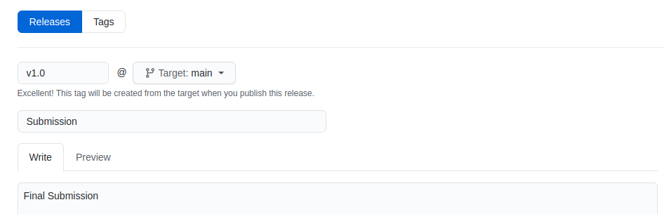

# Submission Instructions
Please follow these guidlines for submitting your homework.

1. Push your code to your `main` branch on GitHub
2. Tag your final submission as `v1.0`. If you need to resubmit, just up the minor revision (e.g. `v1.1`). You can also include "Submission" as the message.

We will use the timestamp on your tagged submission for assessing late penalties.

You can tag your code either on GitHub or via the command line.

## Tagging via GitHub (recommended)
In the Code tab in GitHub, select "tags" below the header tabs or "Create a New Release" in the right panel. See the example below:



## Tagging via Command Line
Alternatively, you can tag via the command line:
```
git tag -a v1.0 -m "submission"
git push origin v1.0
```
